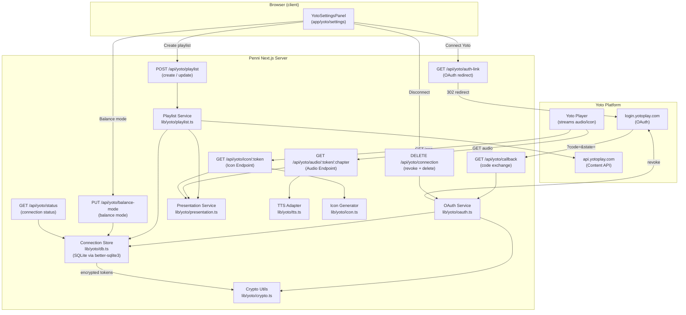

# Design Document: Yoto Integration

## Overview

This feature adds an optional Yoto integration to the Penni Pig parent app. A parent connects their Yoto account via an OAuth 2.0 authorization-code + PKCE flow. Once connected, Penni creates a "Penni Pig" MYO (Make Your Own) playlist in the parent's Yoto library containing three chapters. When a child inserts the linked physical MYO card into a Yoto Player, the player streams audio and a 16×16 pixel icon directly from Penni's API using an opaque, token-secured URL.

Penni remains the financial system of record. Raw TrueLayer data never leaves the Penni backend. The Yoto service only receives derived, child-safe presentation data through the Audio and Icon endpoints, which are protected by a hashed Media Access Token embedded in the playlist URLs.

**Key design goals:**

- Mirror the existing TrueLayer OAuth pattern (`app/api/auth-link`, `complete-bank-link`, `refresh-bank`) to keep the codebase consistent.
- Keep all Yoto credentials server-side only; no tokens ever reach the browser.
- Generate audio dynamically via a pluggable TTS adapter (ElevenLabs as primary, with a scripted-fallback adapter for offline/cost scenarios).
- Generate 16×16 32-bit RGBA PNG icons in-process without native binaries, using `pngjs`.
- Store connection state in a lightweight SQLite database via `better-sqlite3`, using AES-256-GCM encryption for token fields.

---

## Architecture

### Component Boundary Diagram



### Request Flow: Card Play

When a child inserts the MYO card:

1. Yoto Player fetches chapter icon via `GET /api/yoto/icon/{mediaToken}`.
2. Yoto Player fetches chapter audio via `GET /api/yoto/audio/{mediaToken}/{chapterKey}`.
3. Both endpoints hash the provided `mediaToken`, look up the family's connection record, and resolve the current `YotoPresentationState`.
4. The Audio Endpoint calls the TTS adapter to synthesise an MP3 from a generated script.
5. The Icon Endpoint calls the Icon Generator, which renders the current `goalProgressPercent` as a filled-bar PNG and returns it with `Content-Type: image/png`.

Neither endpoint logs the token value or any child name. Both set `Cache-Control: private, no-store`.

---

## Components and Interfaces

### New File Layout

```
app/
  api/
    yoto/
      auth-link/route.ts          # GET  – start OAuth flow
      callback/route.ts           # GET  – complete OAuth flow
      status/route.ts             # GET  – connection status for UI
      playlist/route.ts           # POST – create / update playlist
      balance-mode/route.ts       # PUT  – update balance mode
      connection/route.ts         # DELETE – disconnect
      audio/[token]/[chapter]/
        route.ts                  # GET  – Audio Endpoint
      icon/[token]/
        route.ts                  # GET  – Icon Endpoint
  yoto/
    settings/
      page.tsx                    # YotoSettingsPanel (client component)
lib/
  yoto/
    crypto.ts                     # AES-256-GCM encrypt/decrypt, SHA-256 hash
    db.ts                         # Connection Store (SQLite wrapper)
    oauth.ts                      # OAuth service (PKCE flow, token refresh)
    presentation.ts               # Presentation Service (YotoPresentationState)
    playlist.ts                   # Playlist Service (Yoto content API calls)
    tts.ts                        # TTS Adapter interface + ElevenLabs impl
    icon.ts                       # Icon Generator (pngjs, 16×16 RGBA)
    types.ts                      # YotoPresentationState, YotoConnection types
```

### API Route Contracts

#### `GET /api/yoto/auth-link`

Generates a PKCE `code_verifier` (43–128 chars, URL-safe random), derives `code_challenge` (SHA-256 base64url), generates a cryptographically random `state` (≥128 bits entropy), stores both in an `httpOnly` session cookie, and redirects to:

```
https://login.yotoplay.com/authorize
  ?response_type=code
  &client_id={YOTO_CLIENT_ID}
  &redirect_uri={origin}/api/yoto/callback
  &scope=user:content:manage%20offline_access
  &state={state}
  &code_challenge={code_challenge}
  &code_challenge_method=S256
```

Mirrors the pattern in `app/api/auth-link/route.ts`.

#### `GET /api/yoto/callback`

Validates `state` and `error` query params. Exchanges the `code` for tokens using the stored `code_verifier`. Encrypts and stores both tokens. Redirects to `/settings?yoto=connected`.

#### `GET /api/yoto/status`

Returns the family's connection record summary (no token values):

```ts
{
  status: "not_connected" | "connecting" | "connected_no_playlist"
         | "playlist_ready" | "ready" | "needs_attention";
  yotoAccountId?: string;
  balanceMode?: "hidden" | "rounded" | "exact";
  playlistId?: string;
}
```

#### `POST /api/yoto/playlist`

Calls the Playlist Service to create or update the Penni Pig card via `POST /card` or `PUT /card/{cardId}` on the Yoto API. Returns `{ playlistId }` on success.

#### `PUT /api/yoto/balance-mode`

Body: `{ balanceMode: "hidden" | "rounded" | "exact" }`. Persists to Connection Store, triggers presentation state refresh if a playlist exists.

#### `DELETE /api/yoto/connection`

Body (optional): `{ deletePlaylist: boolean }`. Revokes tokens, deletes connection record, optionally deletes the Yoto card.

#### `GET /api/yoto/audio/[token]/[chapter]`

- Authenticates via `token` path segment (hash-compare).
- Resolves `YotoPresentationState` for the matched family.
- Generates an MP3 script for the chapter and streams it back.
- Chapter keys: `update` (chapter 1), `changed` (chapter 2), `moment` (chapter 3).

#### `GET /api/yoto/icon/[token]`

- Authenticates via `token` path segment (hash-compare).
- Resolves `YotoPresentationState`.
- Generates and returns a 16×16 32-bit RGBA PNG.

### OAuth Service (`lib/yoto/oauth.ts`)

```ts
interface OAuthService {
  buildAuthUrl(origin: string): { url: string; state: string; codeVerifier: string };
  exchangeCode(code: string, codeVerifier: string, origin: string): Promise<TokenPair>;
  refreshTokens(familyId: string): Promise<TokenPair>;
  revokeTokens(familyId: string): Promise<void>;
}
```

Token refresh (called lazily before any Yoto API call):
- Reads encrypted tokens from DB, decrypts.
- If access token is expired: POST to `https://login.yotoplay.com/oauth/token` with `grant_type=refresh_token`.
- Atomically writes new tokens; retains old refresh token if not rotated.
- On 400/401 from Yoto: sets connection status to `needs_attention`, does not retry.
- On 5xx/network: retries up to 3 times with ≥5 s interval; then sets `needs_attention`.

### Presentation Service (`lib/yoto/presentation.ts`)

```ts
interface PresentationService {
  derive(familyId: string): YotoPresentationState | null;
}
```

Reads only `PenniPlan` (from `lib/storage` server-side helpers or an equivalent server-readable store) and `YotoConnection.balanceMode`. Never reads raw TrueLayer responses. Populates the `YotoPresentationState` fields. Returns `null` if plan data is unavailable.

### Playlist Service (`lib/yoto/playlist.ts`)

Calls the Yoto content API to create or update the "Penni Pig" card. Constructs chapter objects with:

- `key` — short identifier (`"01-update"`, `"02-changed"`, `"03-moment"`)
- `title` — human-readable chapter name
- `url` — `https://{origin}/api/yoto/audio/{mediaToken}/{chapterKey}`
- `display.icon16x16` — `https://{origin}/api/yoto/icon/{mediaToken}`

Chapters 1 and 2 use streaming (`url` pointing to the Audio Endpoint). Chapter 3 uses a pre-uploaded static MP3 stored in `public/yoto/moment.mp3` (served via Next.js static file handler).

### TTS Adapter (`lib/yoto/tts.ts`)

```ts
interface TTSAdapter {
  synthesize(script: string): Promise<Buffer>; // MP3 buffer
}
```

Two implementations:

1. **ElevenLabsAdapter** — calls `POST https://api.elevenlabs.io/v1/text-to-speech/{voiceId}` with `output_format: mp3_44100_64`. Requires `ELEVENLABS_API_KEY` env var. Returns response body as a Buffer.
2. **ScriptedFallbackAdapter** — returns a minimal valid MP3 stub (silence or a pre-recorded asset at `public/yoto/fallback.mp3`). Used when `ELEVENLABS_API_KEY` is absent or when the ElevenLabs call fails.

The Audio Endpoint selects the active adapter at startup via `process.env.TTS_PROVIDER` (`"elevenlabs"` | `"fallback"`), defaulting to `"fallback"` if the key is missing.

### Icon Generator (`lib/yoto/icon.ts`)

```ts
function generateIcon(goalProgressPercent: number | undefined): Buffer; // PNG buffer
```

Uses `pngjs` (pure-JavaScript PNG encoder) to produce a 16×16 32-bit RGBA PNG. No native binaries required, compatible with the Next.js runtime.

Rendering logic:
- Full icon is 16×16 pixels.
- Each pixel row represents `100/16 ≈ 6.25%` of progress.
- Filled rows (from the bottom): `Math.round(goalProgressPercent / 100 * 16)`.
- Filled pixels use the Penni green (`#4ade80`, fully opaque).
- Unfilled pixels use a dark background (`#1f2937`, fully opaque).
- If `goalProgressPercent` is `undefined`: all 16 rows are filled (static full-fill icon).

### Crypto Utilities (`lib/yoto/crypto.ts`)

```ts
function encryptToken(plaintext: string): string;   // returns "iv:ciphertext:authTag" (base64url)
function decryptToken(ciphertext: string): string;
function hashToken(token: string): string;           // SHA-256, hex digest
function generateSecureToken(bytes?: number): string; // crypto.randomBytes(bytes), base64url
```

AES-256-GCM encryption:
- Key derived from `process.env.YOTO_ENCRYPTION_KEY` (must be a 32-byte hex string).
- Unique 12-byte IV generated per encryption operation via `crypto.randomBytes(12)`.
- Stored format: `${iv_hex}:${ciphertext_base64url}:${authTag_hex}`.
- Auth tag verified on decryption; any mismatch throws.

Media Access Token security:
- Only the SHA-256 hex hash is stored in the DB.
- The plaintext token is passed to the Yoto API once (embedded in playlist URLs), then never logged or re-stored.
- On token rotation, the new token's URLs are pushed to the Yoto API before the old hash is invalidated (atomic swap).

---

## Data Models

### New TypeScript Types (`lib/yoto/types.ts`)

```ts
export type BalanceMode = "hidden" | "rounded" | "exact";

export type ConnectionStatus =
  | "not_connected"
  | "connecting"
  | "connected_no_playlist"
  | "playlist_ready"
  | "ready"
  | "needs_attention";

export type YotoConnection = {
  familyId: string;                   // opaque identifier for this Penni installation
  yotoAccountId: string | null;       // Yoto user identifier returned after OAuth
  status: ConnectionStatus;
  encryptedAccessToken: string | null; // AES-256-GCM ciphertext
  accessTokenExpiresAt: string | null; // ISO 8601 UTC
  encryptedRefreshToken: string | null;
  playlistId: string | null;          // Yoto card/content ID
  mediaTokenHash: string | null;      // SHA-256 hex of the Media Access Token
  balanceMode: BalanceMode;
  oauthState: string | null;          // temp: PKCE state (cleared after callback)
  oauthCodeVerifier: string | null;   // temp: PKCE verifier (cleared after callback)
  oauthExpiresAt: string | null;      // temp: 10-minute expiry for pending flow
  updatedAt: string;                  // ISO 8601 UTC
};

export type YotoPresentationState = {
  childDisplayName?: string;          // optional, from parent settings
  balanceMode: BalanceMode;           // required
  availableAmountPence?: number;      // conditional integer (omitted when hidden)
  goalName?: string;                  // first active save goal name
  goalProgressPercent?: number;       // integer 0–100, capped at 100
  weeklyChangePence?: number;         // positive = net saving, negative = net spending
  activityPromptId: string;           // required; "fallback" when data unavailable
  generatedAt: string;                // ISO 8601 UTC
};
```

### SQLite Database Schema (`lib/yoto/db.ts`)

The database file lives at `data/yoto.db` (outside the `app/` and `public/` trees, not served statically). The path is configurable via `YOTO_DB_PATH` env var for deployment flexibility.

```sql
CREATE TABLE IF NOT EXISTS yoto_connections (
  family_id                TEXT PRIMARY KEY NOT NULL,
  yoto_account_id          TEXT,
  status                   TEXT NOT NULL DEFAULT 'not_connected',
  encrypted_access_token   TEXT,
  access_token_expires_at  TEXT,
  encrypted_refresh_token  TEXT,
  playlist_id              TEXT,
  media_token_hash         TEXT,
  balance_mode             TEXT NOT NULL DEFAULT 'hidden',
  oauth_state              TEXT,
  oauth_code_verifier      TEXT,
  oauth_expires_at         TEXT,
  updated_at               TEXT NOT NULL
);
```

`better-sqlite3` is used for synchronous access within Next.js Route Handlers (no async overhead; runs in Node.js runtime only — not Edge runtime).

**Family ID strategy:** For this single-family app, the `familyId` is a stable UUID generated once and stored server-side (e.g., as an env var `PENNI_FAMILY_ID` or derived from a server-only secret). All DB operations target this single row. If multi-family support is added later, the JWT/session layer provides the `familyId`.

### Environment Variables

| Variable | Required | Description |
|---|---|---|
| `YOTO_CLIENT_ID` | Yes | Yoto OAuth client ID |
| `YOTO_CLIENT_SECRET` | Yes | Yoto OAuth client secret |
| `YOTO_AUTH_URL` | No | Auth base URL (default: `https://login.yotoplay.com`) |
| `YOTO_API_URL` | No | API base URL (default: `https://api.yotoplay.com`) |
| `YOTO_ENCRYPTION_KEY` | Yes | 32-byte hex string for AES-256-GCM |
| `YOTO_DB_PATH` | No | SQLite file path (default: `data/yoto.db`) |
| `PENNI_FAMILY_ID` | Yes | Stable UUID identifying this family's record |
| `ELEVENLABS_API_KEY` | No | If absent, falls back to scripted MP3 |
| `ELEVENLABS_VOICE_ID` | No | Voice to use (default: `EXAVITQu4vr4xnSDxMaL`) |
| `TTS_PROVIDER` | No | `"elevenlabs"` or `"fallback"` (default: auto-detect) |

---

## Correctness Properties

*A property is a characteristic or behavior that should hold true across all valid executions of a system — essentially, a formal statement about what the system should do. Properties serve as the bridge between human-readable specifications and machine-verifiable correctness guarantees.*

### Property 1: YotoPresentationState serialisation round-trip

*For any* valid `YotoPresentationState` object, serialising it to JSON and then deserialising it SHALL produce an object with identical values for every declared field.

**Validates: Requirements 12.4, 12.1, 12.2**

---

### Property 2: Invalid JSON deserialisation produces a structured error

*For any* string that does not conform to the `YotoPresentationState` schema (missing required fields, wrong types, or malformed JSON), deserialising it SHALL return a structured error value containing `errorType` and `message` fields, and SHALL NOT produce a partial state object.

**Validates: Requirements 12.3, 12.2**

---

### Property 3: `hidden` balance mode never exposes an amount

*For any* `YotoPresentationState` derived with `balanceMode: "hidden"`, the `availableAmountPence` field SHALL be absent from the object.

**Validates: Requirements 4.4, 7.5**

---

### Property 4: `rounded` amounts are rounded to the nearest 100 pence

*For any* Penni plan state and any `availableAmountPence` value, when `balanceMode` is `"rounded"`, the `availableAmountPence` field in the derived `YotoPresentationState` SHALL be a multiple of 100.

**Validates: Requirements 4.3**

---

### Property 5: Icon fill rows match goal progress

*For any* integer `goalProgressPercent` in [0, 100], generating the 16×16 icon SHALL produce a PNG where the number of filled pixel rows from the bottom equals `Math.round(goalProgressPercent / 100 * 16)`, accurate to ±1 pixel row.

**Validates: Requirements 6.4**

---

### Property 6: Media Access Token authentication — hash mismatch returns 401

*For any* token string that does not match the SHA-256 hash stored for the family's connection, a request to the Audio Endpoint or Icon Endpoint using that token SHALL receive HTTP 401, with no audio or image content in the response body.

**Validates: Requirements 10.3, 5.7, 6.6, 11.3**

---

### Property 7: PKCE `state` parameter has sufficient entropy

*For any* invocation of `buildAuthUrl`, the generated `state` parameter SHALL contain at least 128 bits of entropy (i.e., the raw byte source is at least 16 bytes from a CSPRNG).

**Validates: Requirements 1.4**

---

### Property 8: PKCE `code_verifier` length is within the RFC 7636 bounds

*For any* invocation of `buildAuthUrl`, the generated `code_verifier` SHALL be between 43 and 128 characters (inclusive) of URL-safe characters.

**Validates: Requirements 1.4**

---

### Property 9: Encrypt then decrypt is identity

*For any* non-empty string token, encrypting it and then decrypting the result SHALL produce the original string.

**Validates: Requirements 1.8, 10.2**

---

### Property 10: `goalProgressPercent` is always capped at 100

*For any* Penni plan where `allocated >= target` for the primary save goal, the derived `YotoPresentationState.goalProgressPercent` SHALL be exactly 100.

**Validates: Requirements 4.6**

---

## Error Handling

### OAuth Flow Errors

| Scenario | Behaviour |
|---|---|
| `state` mismatch on callback | Reject with 400; do NOT store tokens; redirect to `/settings?yoto=error=state_mismatch` |
| PKCE `code_challenge` validation failure | Same as `state` mismatch |
| OAuth flow not completed within 10 minutes | Invalidate `oauthState` and `oauthCodeVerifier`; display expiry message in UI |
| Authorization code exchange fails (4xx) | Return structured error; do not modify connection record |
| Authorization code exchange fails (5xx/network) | Return 502 with user-friendly message; do not modify connection record |

### Token Refresh Errors

| Scenario | Behaviour |
|---|---|
| Yoto returns 400/401 for refresh | Set `status = "needs_attention"`; clear encrypted tokens; do NOT retry |
| Yoto returns 5xx or network timeout | Retry up to 3 times with ≥5 s interval; then set `needs_attention` |
| DB read/decrypt fails | Log error type + correlation ID only; return 500 to caller; do NOT log decrypted values |

### Playlist Errors

| Scenario | Behaviour |
|---|---|
| Yoto API error on create/update | Return user-facing error message; do NOT overwrite existing `playlistId` |
| No Yoto connection or `status !== "connected"` | Return 400 with "Yoto connection required" message |

### Audio / Icon Endpoint Errors

| Scenario | Behaviour |
|---|---|
| Missing or invalid `mediaToken` | HTTP 401; no body distinction between missing vs. invalid |
| Unrecognised chapter key | HTTP 404 |
| `YotoPresentationState` unavailable | HTTP 503 for both Audio (chapters 1, 2) and Icon endpoints |
| Chapter 3 static MP3 asset missing | HTTP 503; do NOT return partial audio |
| TTS synthesis failure | Serve fallback MP3 from `public/yoto/fallback.mp3`; log error type + correlation ID |
| All errors | Set `Cache-Control: private, no-store`; never log token values |

### Disconnect Errors

| Scenario | Behaviour |
|---|---|
| Yoto token revocation fails | Continue with local disconnection; log error type; display informational message to parent |
| Parent opted in to playlist deletion, Yoto API returns error | Continue disconnecting locally; display "playlist could not be deleted from Yoto library" message |

### Retry Queue (Playlist Updates)

If connectivity to the Yoto API is lost during a playlist update, the update is queued in the `yoto_connections` table as a `pending_update` flag. A background retry uses exponential back-off: initial delay 1 s, max delay 30 s, max 3 attempts. Implemented as a lazy retry triggered on the next parent API call rather than a cron job (no cron infrastructure exists in this app).

---

## Testing Strategy

### Assessment: Is PBT Appropriate?

This feature contains a mix of infrastructure wiring (OAuth, API calls) and pure logic (presentation state derivation, serialisation, icon rendering, token hashing). PBT applies to the pure logic layer. The OAuth flow, Yoto API calls, and DB interactions are tested with example-based integration tests and mocks.

### Property-Based Tests

Uses **fast-check** (TypeScript-native, no native binary, works in Jest/Vitest).

Each property test runs a minimum of 100 iterations.

| Property | Test file | Tag |
|---|---|---|
| 1 — Serialisation round-trip | `lib/yoto/__tests__/presentation.pbt.ts` | `Feature: yoto-integration, Property 1: YotoPresentationState serialisation round-trip` |
| 2 — Invalid JSON returns structured error | `lib/yoto/__tests__/presentation.pbt.ts` | `Feature: yoto-integration, Property 2: Invalid JSON deserialisation produces a structured error` |
| 3 — `hidden` mode omits amount | `lib/yoto/__tests__/presentation.pbt.ts` | `Feature: yoto-integration, Property 3: hidden balance mode never exposes an amount` |
| 4 — `rounded` amounts are multiples of 100 | `lib/yoto/__tests__/presentation.pbt.ts` | `Feature: yoto-integration, Property 4: rounded amounts are rounded to the nearest 100 pence` |
| 5 — Icon fill rows match progress | `lib/yoto/__tests__/icon.pbt.ts` | `Feature: yoto-integration, Property 5: Icon fill rows match goal progress` |
| 6 — Hash mismatch returns 401 | `lib/yoto/__tests__/crypto.pbt.ts` | `Feature: yoto-integration, Property 6: Media Access Token authentication — hash mismatch returns 401` |
| 7 — State entropy ≥128 bits | `lib/yoto/__tests__/crypto.pbt.ts` | `Feature: yoto-integration, Property 7: PKCE state parameter has sufficient entropy` |
| 8 — `code_verifier` length bounds | `lib/yoto/__tests__/crypto.pbt.ts` | `Feature: yoto-integration, Property 8: PKCE code_verifier length is within RFC 7636 bounds` |
| 9 — Encrypt/decrypt identity | `lib/yoto/__tests__/crypto.pbt.ts` | `Feature: yoto-integration, Property 9: Encrypt then decrypt is identity` |
| 10 — Progress capped at 100 | `lib/yoto/__tests__/presentation.pbt.ts` | `Feature: yoto-integration, Property 10: goalProgressPercent is always capped at 100` |

### Unit / Example-Based Tests

- **OAuth Service**: mock Yoto auth server, verify PKCE parameters, state validation, token exchange, retry logic on refresh.
- **Presentation Service**: concrete PenniPlan fixtures for each `BalanceMode`; verify exact field presence/absence.
- **Playlist Service**: mock Yoto content API; verify correct chapter structure and URL format for create vs. update paths.
- **Connection Store**: in-memory SQLite (`:memory:`); verify CRUD operations, status transitions, and that encrypted fields are never returned as plaintext.
- **Audio Endpoint**: mock TTS adapter and Presentation Service; verify correct HTTP status codes for all error scenarios.
- **Icon Endpoint**: verify HTTP status codes; verify `Content-Type: image/png`; verify dimensions using `pngjs`'s own decode.
- **UI States**: React Testing Library snapshot tests for each of the 6 `ConnectionStatus` values rendered by `YotoSettingsPanel`.

### Integration Tests (Example-Based, Not PBT)

These test infrastructure wiring with 1–3 examples; 100 iterations would not reveal additional bugs:

- Full OAuth flow with a test Yoto account (or Yoto sandbox if available).
- Token refresh cycle: confirm rotated token is persisted; confirm `needs_attention` on 401.
- Playlist create → update round-trip against the Yoto API staging environment.
- Audio Endpoint with real ElevenLabs call (gate behind `INTEGRATION_TESTS=true` flag).

### Test Runner

The project currently has no test framework. Add **Vitest** with `vitest --run` for CI (no watch mode). Install:

```
fast-check     # property-based testing
pngjs          # PNG encode/decode (also used at runtime)
better-sqlite3 # runtime DB + in-memory test DB
vitest         # test runner
@vitest/coverage-v8  # coverage
```
